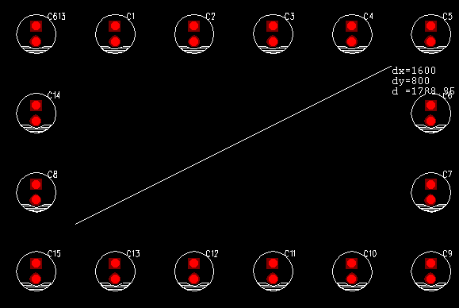
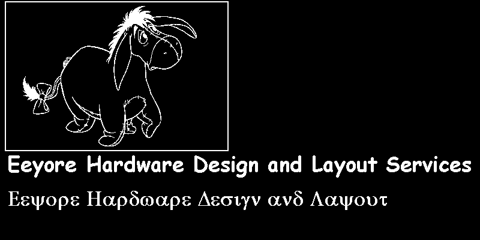
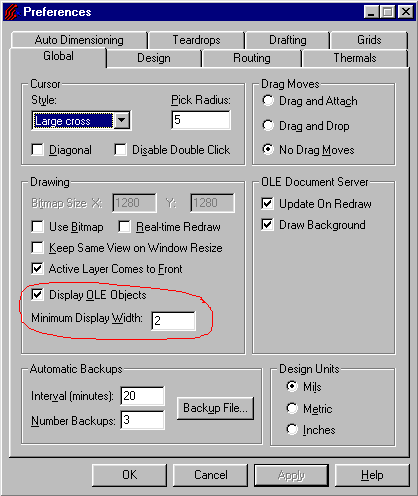
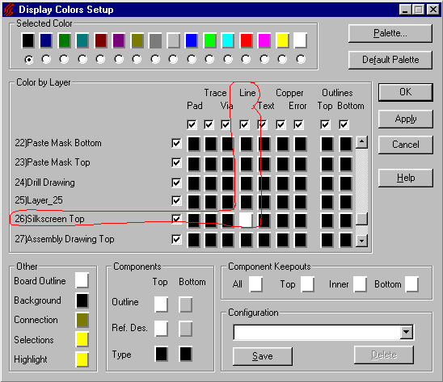
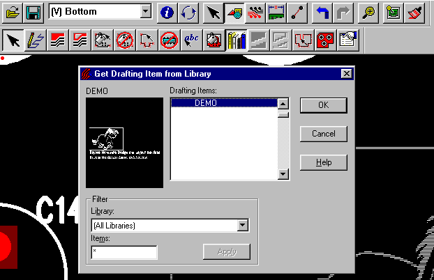
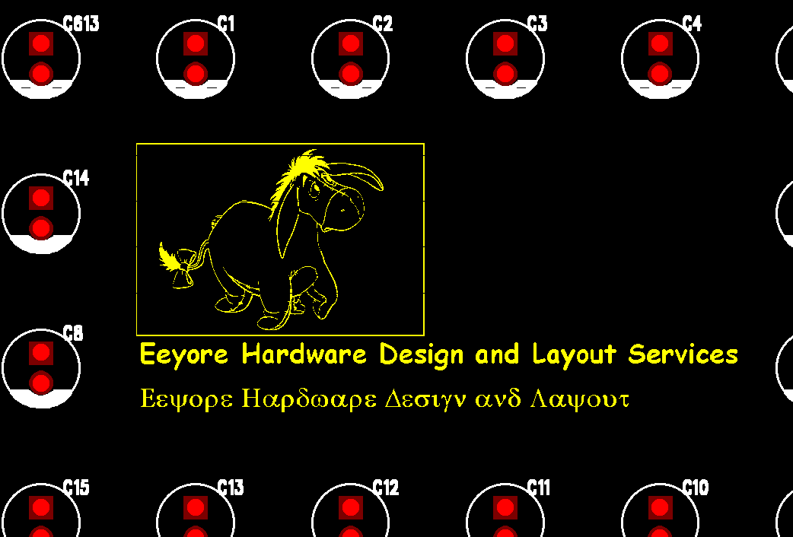

# bmp2asc

I wrote this utility back in 1998, releasing on the web in 1999.  It was orginally hosted on flash.net, and basically disappeared when that company went under.  It did however live on in many user groups and was used by many thousands of board designers.  My understanding is that windows 7 made the original binary difficult to run, and its use started to fade after that.  Someone wrote a version in basic that would run inside the layout tool at some point but I don't know much more than that.

Anyway, I ran across the original code on an old hard drive and thought I would post it here.  Below is the (slightly modified) web page I set up (running on a server in my closet) back in 1999.  Enjoy!

----

Why?

This tool is used to import company or regulatory logos, or other graphical elements into the PADs database. These images can then be placed on the silkscreen, or any other layer.

How?

This tool will scan a windows BMP (two color only) file and convert it into a PADs .ASC file format. This file can then be imported into the design database. In scanning the BMP file, a left to right, top to bottom approach is used. Each continuous group of white pixels is translated into a single line segment in the ASC file.

What is the best method to use?

Any two color, black and white BMP file can be converted. However, for best results, please use the following method (we’ll talk in Mils, and try to show examples):

First, determine the size of the area on the PCB for the picture:

This image size is 1600x800 (Quite large, actually. Most areas for logos will be much smaller).

Next, find the picture that you want to put in that area. If you have a graphic designer generating the image, tell him/her to create it using half the area measured (800x400), and to use only white and black (dithering and colors don’t look good when translated to silkscreen). We’ll use a picture with some text:

I would like to take this time to plug my favorite tool for the graphical work: PaintShop Pro. You can get it from http://www.jasc.com/. This is a useful tool for grabbing images from the screen, converting them to black and white, scaling them to fit and saving them in windows bitmap format.

Once this bit map is saved in 2 color mode, we run the program with the following arguments (assuming the program and the bit map are in the same directory):

BMP2ASC input.bmp output.asc 2 26 0 0

This will scan the data and convert it to horizontal lines 2 mils wide. These lines will be placed on layer 26 (silkscreen top), and the lower left-hand corner of the image will be at 0,0.

Next open up a new PADs file, and import the ASC file. Be sure to set the color and the minimum display width:

Select the complete item, and then combine it. This may take a while for complex images. Once complete, select save to library from the mouse right-click menu.

You can now past it in to existing designs using the paste from library button bar:

And, the final results:

Click to download bmp2asc.exe
 

Please distribute this to any one you think may find it useful. If you find it useful, please send me an email, just to let me know (I can then send updates, if you would like). I cannot guarantee any support, but if you have problems, need help or want to suggest improvements, let me know.

Regards,

James Tidman

Mail: bmp2asc@tidmanfamily.com
